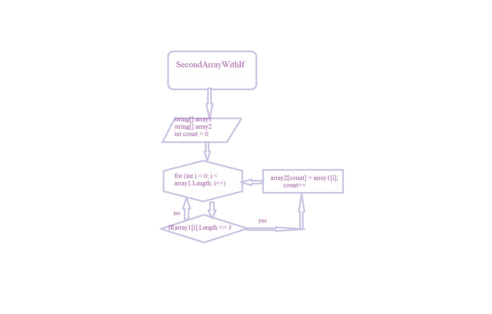

# Итоговый тест

## *Задание:* Написать программу, которая из имеющегося массива строк формирует массив из строк, длина которых меньше либо равна 3 символа. Первоначальный массив можно ввести с клавиатуры, либо задать на старте выполнения алгоритма. При решении не рекомендуется пользоваться коллекциями, лучше обойтись исключительно массивами.

## **Алгоритм**

1. Задаем массив с данными.
2. Задаем массив, размер которого равен размеру 1-го массива.
3. С помощью ф-ции void создаем цикл и условие (длина меньше или равна 3 символам)
4. С помощью ф-ции void создаем цикл (где i делает шаг +1) и условие для вывода нужных данных.

Задание в папке task. 

Блок-схема:

